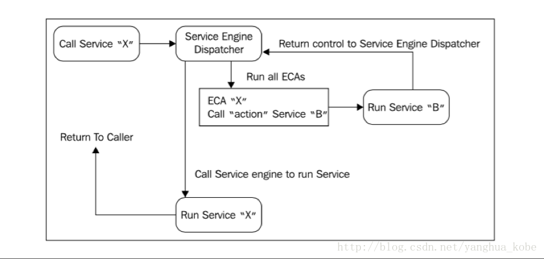
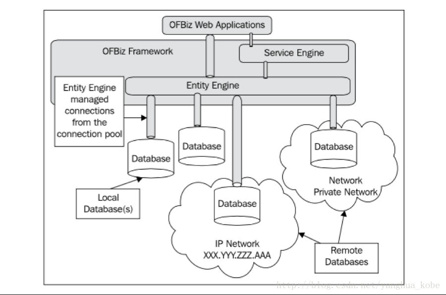
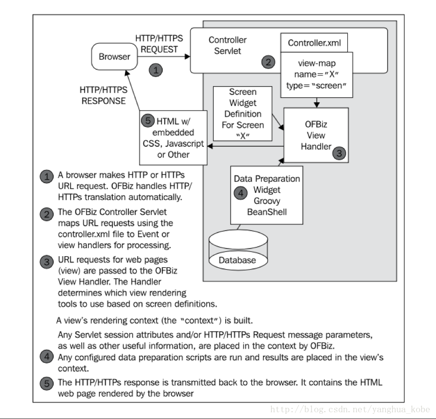

# DDD<!-- TOC -->

- [DDD](#ddd)
    - [1. 了解DDD](#1-了解ddd)
    - [2. ofbiz](#2-ofbiz)
        - [2.1 ofbiz简单介绍](#21-ofbiz简单介绍)
        - [2.2 ofbiz安装使用](#22-ofbiz安装使用)
        - [2.3 ofbiz初体验，开发一个简单的hellow，world页面](#23-ofbiz初体验开发一个简单的hellowworld页面)
        - [2.4 ofbiz引擎介绍](#24-ofbiz引擎介绍)
            - [2.4.1 实体引擎](#241-实体引擎)
            - [2.4.2 服务引擎](#242-服务引擎)
            - [2.4.3 规则引擎和流程引擎](#243-规则引擎和流程引擎)
        - [2.5 ofbiz执行原理](#25-ofbiz执行原理)
        - [2.6 ofbiz实战进阶](#26-ofbiz实战进阶)
        - [2.7 ofbiz一些总结和思考](#27-ofbiz一些总结和思考)
    - [3. outsystem](#3-outsystem)

## 1. 了解DDD

领域驱动模型不是一个新概念了，领域建模专家Eric Evans在04年发表了《Domain Driven Design》一书后，业界已经开始使用。

领域模型是体现业务内容和软件系统两个专业领域的交汇，需要对概念进行聚合和模式组合，比较理想的是可以做到MDA（模型驱动架构）和MDD（模型驱动开发）。今天主要以ofbiz及outsystem来讲解MDD（模型驱动开发）。

## 2. ofbiz
### 2.1 ofbiz简单介绍
1.  OFBiz是一个很著名的电子商务平台，是一个很著名的开源项目，提供了创建基于最新J2EE/XML规范和技术标准，构建大中型企业级、跨平台、跨数据库、跨应用server的多层、分布式电子商务类WEB应用系统的框架。 OFBiz最基本的特点是OFBiz提供了一整套的开发基于Java的web应用程序的组件和工具。
2.  OFBiz 已经正式成为Apache 的顶级项目: Apache OFBiz。
Ofbiz是 Open Source的商务软件系统，充分利用了各优秀的的Open Source 项目。像 Tomcat，gradle，BeanShell, Jboss 等，构建了一个强大的系统平台，Ofbiz 已经完毕了大部分商务类软件系统都须要的部件，像用户认证、工作流、商务规则处理等。

包含实体引擎, 服务引擎, 消息引擎, 工作流引擎, 规则引擎等。
[详细](http://ofbiz.apache.org/)

### 2.2 ofbiz安装使用

> 环境要求：
1. jdk：1.8
2. 操作系统: win7/win10
3. apache-ofbiz安装包版本：16.11.04
4. 数据库：postgresql 9.5
> 快速启动
1. 使用ide打开apache-ofbiz-16.11.04
2. 打开postgresql建库ofbiz，ofbizolap，ofbiztenant
3. 修改默认数据库连接，修改$OFBIZ_HOME/framework/entity/config
```xml
<delegator name="default" entity-model-reader="main" entity-group-reader="main" entity-eca-reader="main" distributed-cache-clear-enabled="false">
        <!--<group-map group-name="org.apache.ofbiz" datasource-name="localderby"/>-->
        <!--<group-map group-name="org.apache.ofbiz.olap" datasource-name="localderbyolap"/>-->
        <!--<group-map group-name="org.apache.ofbiz.tenant" datasource-name="localderbytenant"/>-->
        <group-map group-name="org.apache.ofbiz" datasource-name="localpostgres"/>
        <group-map group-name="org.apache.ofbiz.olap" datasource-name="localpostolap"/>
        <group-map group-name="org.apache.ofbiz.tenant" datasource-name="localposttenant"/>
    </delegator>
    <delegator name="default-no-eca" entity-model-reader="main" entity-group-reader="main" entity-eca-reader="main" entity-eca-enabled="false" distributed-cache-clear-enabled="false">
        <!--<group-map group-name="org.apache.ofbiz" datasource-name="localderby"/>-->
        <!--<group-map group-name="org.apache.ofbiz.olap" datasource-name="localderbyolap"/>-->
        <!--<group-map group-name="org.apache.ofbiz.tenant" datasource-name="localderbytenant"/>-->
        <group-map group-name="org.apache.ofbiz" datasource-name="localpostgres"/>
        <group-map group-name="org.apache.ofbiz.olap" datasource-name="localpostolap"/>
        <group-map group-name="org.apache.ofbiz.tenant" datasource-name="localposttenant"/>
    </delegator>

    <!-- be sure that your default delegator (or the one you use) uses the same datasource for test. You must run "gradlew loadDefault" before running "gradlew testIntegration" -->
    <delegator name="test" entity-model-reader="main" entity-group-reader="main" entity-eca-reader="main">
        <!--<group-map group-name="org.apache.ofbiz" datasource-name="localderby"/>-->
        <!--<group-map group-name="org.apache.ofbiz.olap" datasource-name="localderbyolap"/>-->
        <!--<group-map group-name="org.apache.ofbiz.tenant" datasource-name="localderbytenant"/>-->
        <group-map group-name="org.apache.ofbiz" datasource-name="localpostgres"/>
        <group-map group-name="org.apache.ofbiz.olap" datasource-name="localpostolap"/>
        <group-map group-name="org.apache.ofbiz.tenant" datasource-name="localposttenant"/>
    </delegator>
```
```xml
<datasource name="localpostgres"
<inline-jdbc
                jdbc-driver="org.postgresql.Driver"
                jdbc-uri="jdbc:postgresql://localhost:5432/ofbiz"
                jdbc-username="sa"
                jdbc-password="123456"
                isolation-level="ReadCommitted"
                pool-minsize="2"
                pool-maxsize="250"
                time-between-eviction-runs-millis="600000"/>
<datasource name="localpostolap"
<inline-jdbc
                jdbc-driver="org.postgresql.Driver"
                jdbc-uri="jdbc:postgresql://localhost:5432/ofbizolap"
                jdbc-username="sa"
                jdbc-password="123456"
                isolation-level="ReadCommitted"
                pool-minsize="2"
                pool-maxsize="250"
                time-between-eviction-runs-millis="600000"/><
<datasource name="localposttenant"
<inline-jdbc
                jdbc-driver="org.postgresql.Driver"
                jdbc-uri="jdbc:postgresql://localhost:5432/ofbiztenant"
                jdbc-username="sa"
                jdbc-password="123456"
                isolation-level="ReadCommitted"
                pool-minsize="2"
                pool-maxsize="250"
                time-between-eviction-runs-millis="600000"/>
```
4. 修改$OFBIZ_HOME/build.gradle，添加postgresql引用
```java
    compile 'oro:oro:2.0.8'
    compile 'wsdl4j:wsdl4j:1.6.2'
    compile 'org.jsoup:jsoup:1.11.2'
    compile 'org.postgresql:postgresql:9.4.1208'
```
2. 执行gradlew cleanAll loadDefault
3. 执行gradlew loadDefault ofbiz
4. 在浏览器中打开https://localhost:8443/accounting
5. 输入默认用户名密码：admin/ofbiz
6. 在浏览器中打开https://localhost:8443/webtools
7. 输入默认用户名密码：admin/ofbiz

### 2.3 ofbiz初体验，开发一个简单的hellow，world页面
>目录结构介绍
1. applications目录：Applications目录，包含了OFBIz核心的应用程序组件，如订单管理，电子商务存储等。
component-load.xml文件配置需要载入哪几个应用程序组件。这里的每一个组件，都是一个基于OFBIZ构建的Web应用程序。
2. framework目录：Framework框架目录，包含OFBiz框架的组件，例如实体引擎和服务引擎。这是OFBiz框架的核心，其他应用程序都是基于它来构建的。component-load.xml文件配置需要载入哪几个框架组件。
3. specialpurpose目录：specialpurpose专门目录，包含一些其他的自定义应用程序，不是OFBIZ核心的一部分
4. hot-deploy目录：热部署目录，以后创建的项目，都需要在这个目录下进行部署。
5. config目录：包括创建项目的配置信息文件
6. entitydef目录：包括这个应用程序的数据模型定义，即数据库配置。
7. script脚本目录：包括业务逻辑的脚本文件。
8. servicedef目录：包括services服务。
9. src原文件目录：包括实现业务逻辑的Java类文件。
10. webapp目录：是web的接口，是应用程序的前端。
11. ofbiz-commponent.xml文件：定义应用程序指定配置文件，库文件等，数据模型，业务逻辑，web应用程序的定位。

>步骤
1. Create the plugin/component
2. 执行gradlew createPlugin -PpluginId=helloDemo
3. 在目录$OFBIZ_HOME/specialpurpose/下可以找到helloDemo
4. 在$OFBIZ_HOME/specialpurpose/helloDemo/widget/OfbizDemoScreens.xml添加<label>hellowords</label>
5. 重启ofbiz
6. 在浏览器输入https://localhost:8443/hellowDemo/control/main
7. 可能会报错：Could not find resource bundle [Hellow-demoUiLabels] in the locale [zh_CN] 
8. 因为$OFBIZ_HOME/specialpurpose/helloDemo/config/Hellow-demoUiLabels.xml 里面有乱码，修改下即可
9. 再次启动->gradlew loadDefault ofbiz
9. 输入默认用户名和密码，即可

### 2.4 ofbiz引擎介绍
ofbiz主要有实体引擎，服务引擎，规则引擎/流程引擎。
#### 2.4.1 实体引擎
>简介： 
1. Entity Engine屏蔽了数据库访问的很多细节，通过XML配置文件定义描述实体，实体引擎自动维护实体至数据库的所有细节
2. 支持主流数据库，包括Oracle、MySql、MSSQL、PostgreSql等
3.  OFBiz实体引擎与其他的ORM框架最大的不同，是OFBiz只有一个GenericValue对象，不像其它ORM框架，要定义各种不同类型的，防止产生过多的实体对象，避免产生类爆炸。
4.  OFBiz的GenericValue对象不同于其它ORM框架定义的实体对象，它没有getter和setter方法，全部通过put(key,value)的形式来设置属性的值，保持最大的灵活性

几个概念：
> Entity Delegators：实体代理，使用实体代理来访问数据库。 默认使用localderby。实体可以分组，如果实体没有被分组，默认就分配到org.apache.ofbiz中
``` xml
<delegator name="default" entity-model-reader="main" entity-group-reader="main" entity-eca-reader="main" distributed-cache-clear-enabled="false">
        <!--<group-map group-name="org.apache.ofbiz" datasource-name="localderby"/>-->
        <!--<group-map group-name="org.apache.ofbiz.olap" datasource-name="localderbyolap"/>-->
        <!--<group-map group-name="org.apache.ofbiz.tenant" datasource-name="localderbytenant"/>-->
        <group-map group-name="org.apache.ofbiz" datasource-name="localpostgres"/>
        <group-map group-name="org.apache.ofbiz.olap" datasource-name="localpostolap"/>
        <group-map group-name="org.apache.ofbiz.tenant" datasource-name="localposttenant"/>
    </delegator>
```

> DataSource：数据源，在一个数据库实体中可以有多个数据库schema，不同的schema覆盖各自的实体。数据源定义和配置在entityengine.xml中。
```xml
<datasource name="localpostgres"
<inline-jdbc
                jdbc-driver="org.postgresql.Driver"
                jdbc-uri="jdbc:postgresql://localhost:5432/ofbiz"
                jdbc-username="sa"
                jdbc-password="123456"
                isolation-level="ReadCommitted"
                pool-minsize="2"
                pool-maxsize="250"
                time-between-eviction-runs-millis="600000"/>
```

> 实体：
1. entity：标准实体，是MVC架构中的模型（MODEL）的基本单元；简单的说，就是一个数据库表。
2. view-entity：视图，通常是成员实体通过一系列关系连接起来的集合
3. extend-view：扩展实体，实体能够通过<extend-entity>元素来扩展
```xml
<entity entity-name="OldCustRequestRole" table-name="CUST_REQUEST_ROLE"
            package-name="org.apache.ofbiz.order.request"
            title="Old Customer Request Role Entity">
      <field name="custRequestId" type="id-ne"></field>
      <field name="partyId" type="id-ne"></field>
      <field name="roleTypeId" type="id-ne"></field>
      <prim-key field="custRequestId"/>
      <prim-key field="partyId"/>
      <prim-key field="roleTypeId"/>
      <relation type="one" fk-name="CUSTREQ_RL_CRQST" rel-entity-name="CustRequest">
        <key-map field-name="custRequestId"/>
      </relation>
      <relation type="one" fk-name="CUSTREQ_RL_PARTY" rel-entity-name="Party">
        <key-map field-name="partyId"/>
      </relation>
      <relation type="one-nofk" rel-entity-name="RoleType">
        <key-map field-name="roleTypeId"/>
      </relation>
      <relation type="one" fk-name="CUSTREQ_RL_PROLE" rel-entity-name="PartyRole">
        <key-map field-name="partyId"/>
        <key-map field-name="roleTypeId"/>
      </relation>
    </entity>
```
> 常用实体引擎API
1. GenericPK，GenericPK一般用于生产实体的主键
2. GenericValue，GenericValue通用实体值对象，处理任何被定义实体的持久化
3. GenericDelegator，GeneticDelegator通用的数据库访问代理类，对数据库CRUD的实现都通过该类实现。
``` java
//创建实体
GenericValue party = delegator.makeValue("party");
//更新实体
GenericValue createParty = delegetor.create(party);
createParty.put("partyId", "123");
int updated = delegator.store(createParty);
```
3. EntityCondition，EntityCondition封装查询实体的条件，makeCondition()方法设置查询约束
4. 实体缓存(cache)操作

#### 2.4.2 服务引擎
[服务引擎1](https://www.cnblogs.com/ofbiz/p/3159702.html)

[服务引擎2](https://www.cnblogs.com/ofbiz/p/3160997.html)

#### 2.4.3 规则引擎和流程引擎
OFBiz中有两种类型的ECA规则：Service Event Condition Actions(SECA)和Entity Event Condition Actions(EECA)。
SECA，是指服务执行的过程中的触发其它的操作，在OFBiz中替代了其原有的规则引擎以及工作流引擎。
可以简单得理解成“服务编排”（可能会执行多个服务，但是某些服务需要满足特定的执行条件）。



比如上面一个带SECA的服务X，在服务引擎执行之前，会先处理其ECA（这里先调用一个action，它需要执行服务B）。当ECA处理完成之后，会将控制权返回给执行引擎。执行引擎会根据服务B的执行结果来判断是否会调用真正的服务X。


### 2.5 ofbiz执行原理
框架简介


这张图是OFBiz的整体框架图。从图中可以看到OFBiz的所有app都构建在其framework之上。而其framework的核心就是ServiceEngine（服务引擎）以及EntityEngine（实体引擎）。其实体引擎对于数据库的种类以及拓扑结构的支持都非常健全。它支持本地数据库与远端数据库并存并且支持多达8种主流数据库。

下面以一个客户端请求的处理过程来看OFBiz各个组件是如何交互以及衔接的。


1. 客户端浏览器向web服务器发出一个请求(http/https)，请求会被web容器接收并作相应的处理（比如参数的封装等）。
2. 请求被路由到一个代理servlet中，该servlet会分析请求是发往哪个app的，然后再到该项目的下的controller.xml配置文件中去匹配request-map配置项，该配置项用于只是OFBiz如何处理这个请求。通常的处理过程是先进行安全检查以及权限确认，然后触发某个“事件”或者服务调用，最后会以一个view作为响应。如果是以一个view作为响应的话，OFBiz会去view-map中匹配该视图，每一个视图view都有它对应的handler。
3. OFBiz会用配置的handler来处理该view。handler的作用主要用于渲染页面元素，并将需要展示的数据跟页面元素合并。
4. 数据准备。前端的请求归根到底还是请求对后端数据的操作。而ofbiz中用于获取数据的方式十分丰富。考虑到这里对业务逻辑而言，是代码量占比很大的地方，因此OFBiz尝试利用动态语言来编写这部分代码。主要是想利用动态语言的简洁、代码量少、快速开发的优势。随着java语言的发展，OFBiz选择并且替代了多种不同的JVM脚本语言，比如：beanshell,Groovy。采用脚本语言来编写跟操作实体相关的业务逻辑代码，可谓有利有弊:

```
弊端：动态语言（弱类型语言）固有的类型安全性的缺失以及纯解释执行性能跟Java这种解释+编译型语言还是无法比拟。

优势：大量传统行业，不需要那么高的性能要求；即便需要也可以用提升硬件来改善；脚本语言在编程效率、逻辑简洁性都是Java冗长的代码所望其项背的；脚本语言更贴近人类语言的表达，更适合实现DSL，来表述业务逻辑（而且OFBiz的下一步目标也将增强对Groovy实现DSL的支持）。
```

[详细见](https://blog.csdn.net/yanghua_kobe/article/details/43868773)

### 2.6 ofbiz实战进阶
业务要求：
1. 完成一个学生及班级管理相关业务，对学生班级的增删改查管理。
2. 流程规则管理，在新增一个学生前需要新建一个学生文件档案。

领域对象抽象
1. 学生
2. 班级

### 2.7 ofbiz一些总结和思考
> 总结：
1. ofbiz是一个基于DDD能通过少量代码，大量配置快速来构建一个管理系统
2. ofbiz框架比较重：实体引擎支持8种以上数据库；服务引擎能支持多种不能服务（SOAPClientEngine，ScriptEngine，ServiceGroupEngine，标准Java方法服务引擎，Groovy脚本服务引擎，HTTP 引擎，BeanShell引擎，BSF 引擎，XML RPC引擎，Rmi 服务引擎）；视图使用widget框架页面（基于freemarker）；支持兼容Weblogic，Tomcat，Jboss，Resin，Orion等16个厂商的Web和App应用服务器的版本。
3. 能使用secas及eecas快速对服务引擎及实体引擎服务进行编排控制
4. 使用ofbiz过程中对视图层配置文件xml的修改不需要重启服务，但是对实体层配置文件修改及src源代码文件修改需要重启服务进行编译
5. 能规整项目风格

> 思考
1. ofbiz 配置量太大，掌握该框架成本较高？
2. ofbiz 基于ORM的映射生成的sql，如果一些生成sql技巧不当或设计不当，导致效率比较低？
3. ofbiz不是完全严格上的运行时拓展？
4. ofbiz视图与服务引擎直接耦合比较紧，与我们现在服务客户端分离设计思想冲突？
5. 如果不使用服务引擎和流程引擎，只使用ofbiz实体引擎与spring-jpa-data + OData对比？

> 其它
1. 调试
2. 集成到docker部署


## 3. outsystem


